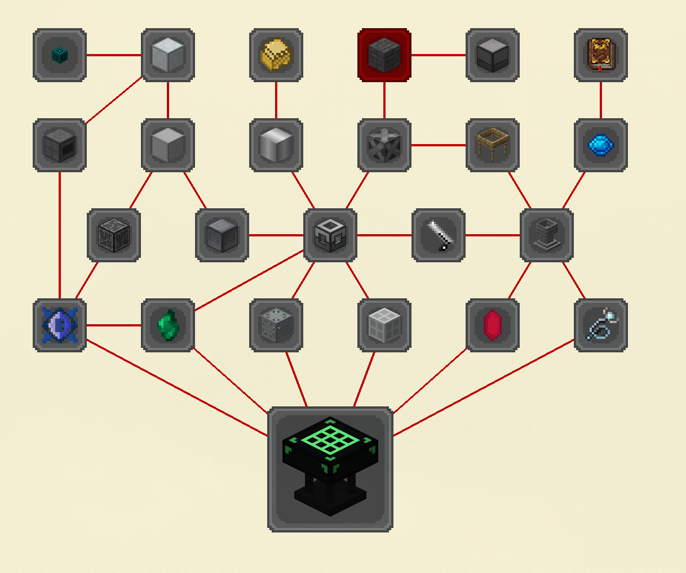

Clone the repo to
PrismLauncher/instances/

https://prismlauncher.org/

Should appear as a pack in prism

Adding to list:

-   Prefer modrinth over curseforge
-   Confirm boots before commiting

Design Goals:
Require building infrastructure, trains and that sort of thing
Slow build up in complexity, gaining access to new mods like one at a time
Some gating via going to space, ores that only exist on the moon, or mars, whatev
T1: Moon
T2: Mars
T3: Mercury and Venus
T4: Glacio

There are ad astra extensions that add more planets to proxima centauri; they are ass!

Overworld Mods Resource Requirements:
Zinc
Copper
Iron
Gold (Only from naura trees?)
Diamond
Nether brick
Redstone

Tier 1:
Do Create Stuff
Get Gold
Steady Supply of Iron, Diamonds, Gold, Etc.
Power
Ingot of the Sky (Spaceship asf)
Electrum
Bio-Diesel

Moon:
*Desh*
Traders
Moon is super rich in some resources (Aluminum? Iron? Titanium?)

Tier 2:
*Desh* from the moon
Pneumatic Stuff
Rocket Fuel
PCBs
Ars stuff
Enchanted *titanium*
Occultism Stuff
Iesnium

Mars:
*Ostrum*

Tier 3:
Botania
Thermal
Enchanted
Powah

Energize some alloy involving Terrasteel

Venus and Mercury:
Calorite
Mercury got hella iron

Bookoo bucks??

